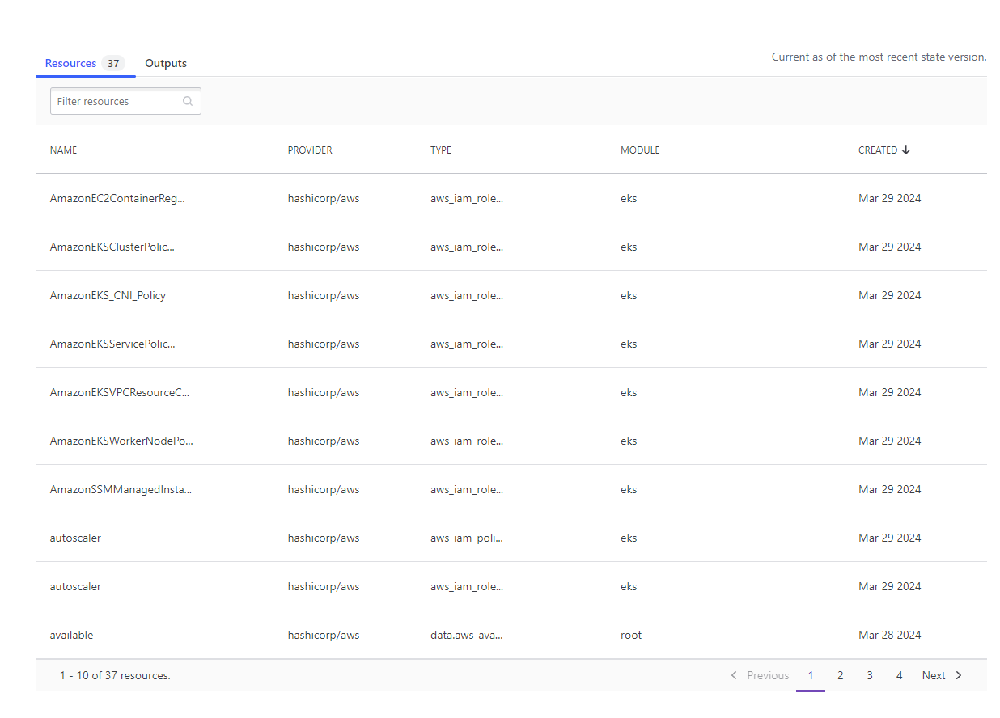
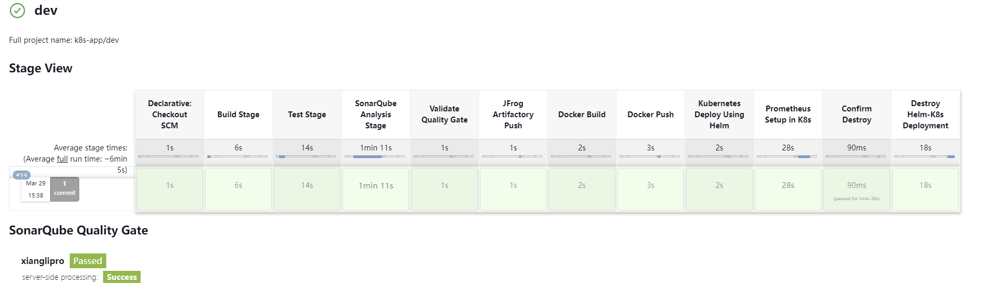
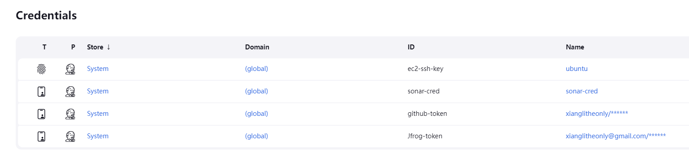

## Project Description

Deploy a container application and Prometheus to Kubernetes automatically with tools including Terraform, Ansible, Jenkins, Maven, SonarQube, Artifactory and Helm.

## Ttrend application

This is a small applicaiton which contains main and test folders. The source code is from https://github.com/ravdy/tweet-trend-new.

## Terraform

* Terraform cloud is used for Terraform state backend.
* Terraform is managing Jenkins cluster and AWS EKS cluster.

## Ansible

* Two ansible playbooks are used to configure Jenkins-master and Jenkins-slave.
* Install Jenkins and required JDK on the Jenkins-master.
* Install JDK, Maven, Docker, Kubectl, AWS CLI and Helm on the Jenkins-slave.

## Jenkins

A multi-branch pipeline including stages of:

* Building stage using Maven
* SonarQube Analysis Stage to detect code vulnerabilities and a Quality Gate to allow or deny
* Push artifacts (.jar) from building to JFrog Artifactory
* Docker build and push the image to JFrog Artifactory
* Using Helm to create a customized chart with kubernetes menifest files and deploy the app in AWS EKS
* Using Helm to deploy Prometheus in Kubernetes cluster

All the credentials are stored in Jenkins credentails. There are github-cred for github personal access, ec2-ssh-key for accessing jenkins-slave, sonar-cred sonarcloud access and Jfrog-token for artifactory repo access.

