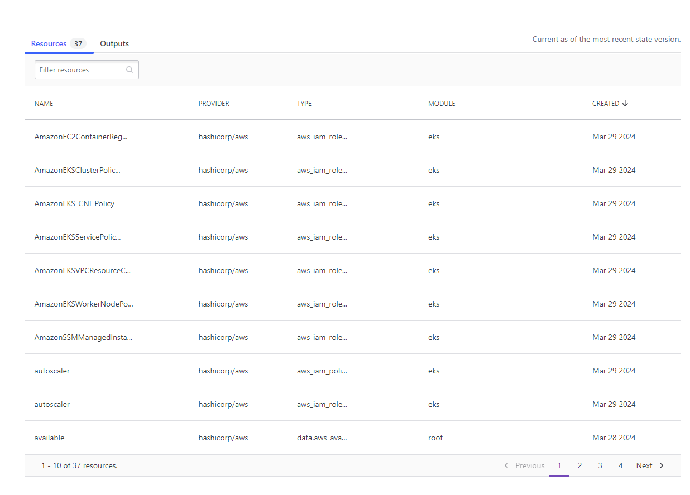
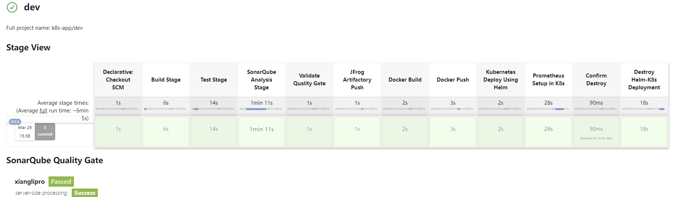
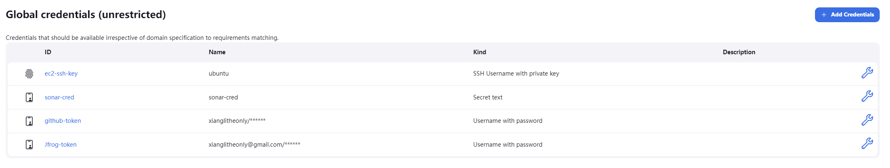
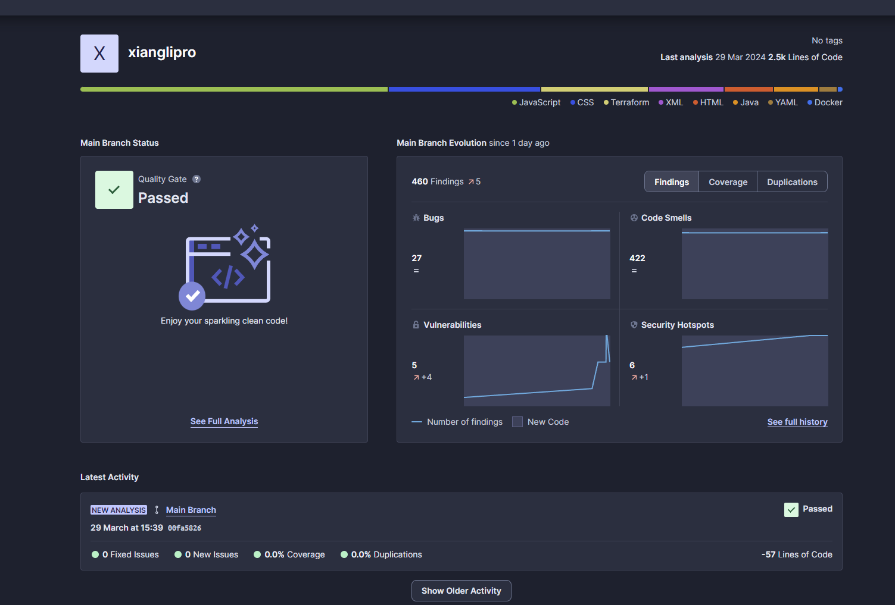
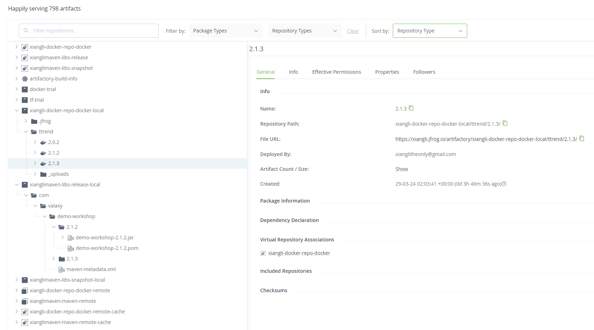
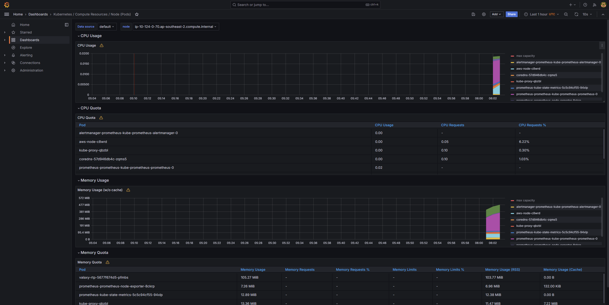

## Project Description

Deploy a container application and Prometheus&Grafana to Kubernetes automatically with tools including Terraform, Ansible, Jenkins, Maven, SonarQube, Artifactory and Helm.

## Ttrend application

This is a small application which contains main and test folders. The source code is from https://github.com/ravdy/tweet-trend-new.

## Terraform

* Terraform cloud is used for Terraform state backend.
* Terraform is managing Jenkins cluster and AWS EKS cluster.

## Ansible

* Two ansible playbooks are used to configure Jenkins-master and Jenkins-slave.
* Install Jenkins and required JDK on the Jenkins-master.
* Install JDK, Maven, Docker, Kubectl, AWS CLI and Helm on the Jenkins-slave.

## Jenkins

A multi-branch pipeline including stages of:

* Building stage using Maven
* SonarQube Analysis Stage to detect code vulnerabilities and a Quality Gate to allow or deny
* Push artifacts (.jar) from building to JFrog Artifactory
* Docker build and push the image to JFrog Artifactory
* Using Helm to create a customized chart with kubernetes manifest files and deploy the app in AWS EKS
* Using Helm to deploy Prometheus in Kubernetes cluster
* Manually approve the helm deployment destroy

All the credentials are stored in Jenkins credentials. There are github-cred for github personal access, ec2-ssh-key for accessing jenkins-slave, sonar-cred sonarcloud access and Jfrog-token for artifactory repo access.

## SonarQube

* Install the sonarqube plugin in the Jenkins
* Configure the sonar server in Jenkins system management and sonar scanner in Jenkins tools
* Create the project, quality gate and token in the sonarcloud
* Create a sonar-project.properties to specify the configuration

## JFrog Artifactory

* Install the Artifactory plugin in the Jenkins
* Create a Maven repositery and a Docker repositery for storing .jar files and Docker image
* Create a token for Jenkins access and a user for Docker login and pulling used by kubernetes

## Helm

* Create a customized chart by replacing the files under template with our kubernetes manifest files
* The kubernetes manifest files including creation of namespace, secrete, deployment, service
* Deploy the ttrend application by the customized chart and Prometheus&Grafana from a published repo prometheus-community https://prometheus-community.github.io/helm-charts
* Modify the service prometheus-grafana to type of loadbalancer and access Grafana dashboard from that AWS LoadBalancer

